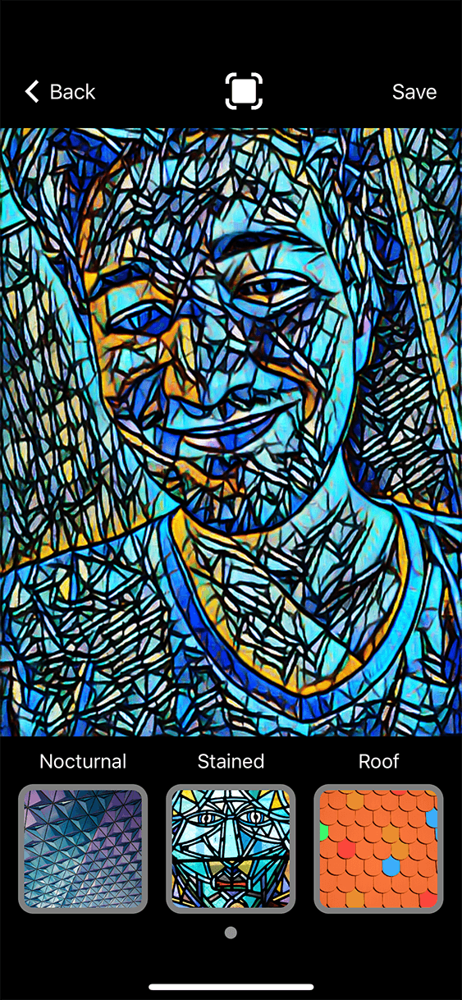
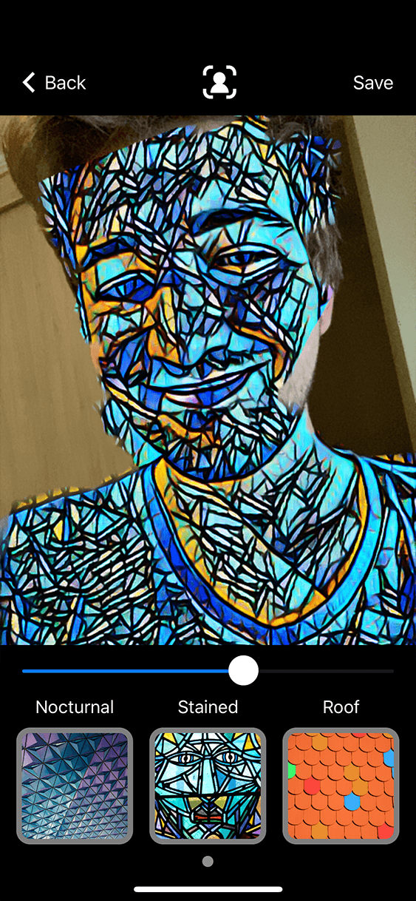

## Artyficial Camera

Artyficial Camera is a CoreML and AVFoundation based app created as my submission to WWDC '20 Swift Challenge. It features machine learning image style transfer to captured photos as well as live real-time preview for provided styles.

There is a also portrait mode support for compatible devices allowing for foreground or background occlusion. It is not perfect since it uses depth maps for video output instead of photo which is less accurate but on other hand it enabled real-time filter preview when capturing an image.

I trained my models using Apple's Turi Create library for Python with my custom set of 5000 images from selfies by food and pets through landscapes. As a reference style I chose three images - abstract triangle mosaic, stained glass and roof tiles which gave me most interesting results.

Although CoreML image processing models should support few output styles, I have run into issues with frequent empty output predictions when I used such models, thus I eventually used one model per style which significally increases size of the app but there are no issues with computed output.

### Building and running
This repository includes both XCode project and PlaygroundBook so there are two options to run the app:

##### Xcode
You can build `Artyficial Camera.xcodeproj` project using XCode and run it natively on Your device. I tested it gon iOS 13.4.1 and XCode 11.4.1 but it should work fine on iOS 13 and XCode 11 and newer.

##### Swift Playgrounds
Other option is to send `Artyficial Camera.playgroundbook` to Your iPad and run it in Swift Playgrounds 3.3 (remember to turn "Enable Results" off as the playground runs unacceptably slow with this option turned on).

Please keep in mind that live filter preview is very demanding task so it is recommended to run it on devices with more powerful CPU & GPU. I personally tested it on iPhone 11 Pro and iPad Pro 10.5 and it was usable although the preview was not fluid.

### Screenshots
 
